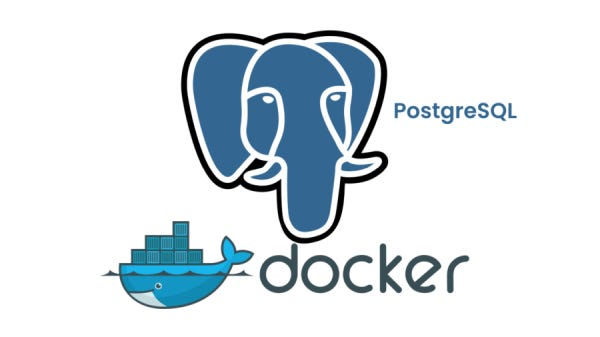

# Práctica: Persistencia de Datos con Docker y PostgreSQL

## 1. Título  
**Persistencia de datos en PostgreSQL usando contenedores y volúmenes Docker**

## 2. Tiempo de duración  
**180 minutos (3 horas)**

## 3. Fundamentos

En esta práctica se explora el uso de contenedores Docker para ejecutar una base de datos PostgreSQL, y cómo utilizar volúmenes para asegurar la persistencia de datos aún después de eliminar el contenedor.

**Docker** permite crear, desplegar y ejecutar aplicaciones usando contenedores. Los contenedores son entornos livianos, portables y consistentes, útiles especialmente en entornos de desarrollo y producción.

Por otro lado, **PostgreSQL** es un sistema de gestión de bases de datos relacional de código abierto ampliamente utilizado. Al ejecutar PostgreSQL dentro de un contenedor, los datos generados por el servicio (bases de datos, tablas, registros) se almacenan por defecto dentro del sistema de archivos del contenedor. Si el contenedor se elimina, estos datos también se pierden.

Para evitar esa pérdida, Docker permite el uso de **volúmenes**, que son espacios de almacenamiento persistente. Al vincular un volumen a un contenedor, se puede asegurar que los datos permanezcan disponibles incluso si el contenedor se detiene o se borra.

<div align="center">
  
  <br>
  Figura 1. Persistencia de datos con volúmenes Docker.
</div>

Esta práctica está dividida en dos partes:

- La primera sin volumen, donde se comprueba la pérdida de datos al eliminar el contenedor.
- La segunda con volumen, donde se verifica que los datos persisten.

 
## 4. Conocimientos previos

Para desarrollar correctamente esta práctica, se requiere que el estudiante tenga conocimiento de:

- Comandos en terminal o consola (`docker`, `ps`, `rm`, etc.)
- Conexión a bases de datos usando herramientas como DataGrip o pgAdmin
- Conceptos básicos de bases de datos relacionales (crear bases, tablas, registros)
- Uso de Docker y sus conceptos principales: imágenes, contenedores, volúmenes


## 5. Objetivos a alcanzar

- Implementar contenedores Docker con PostgreSQL.
- Conectar herramientas de administración a bases de datos dentro de contenedores.
- Comprobar el comportamiento de los datos sin volumen.
- Asociar un volumen al contenedor y verificar la persistencia.
- Documentar el proceso con evidencia.


## 6. Equipo necesario

- Computador con Windows 10 o superior (o Linux/Mac equivalente).
- Docker Desktop instalado (v20.10 o superior).
- Cliente de base de datos como DataGrip, pgAdmin o DBeaver.
- Conexión a internet.
- Terminal o consola habilitada.


## 7. Material de apoyo

- [Documentación oficial de Docker](https://docs.docker.com/)
- [Documentación de PostgreSQL](https://www.postgresql.org/docs/)
- [Guía de Informe](https://github.com/maguaman2/informe-tendencias)
- Guía de comandos básicos de Linux.
- Guía video colocado en la plataforma virtual del Instituto https://drive.google.com/file/d/13lwPiwJhDIXRYozfBBqYqVWaXaVPA1pI/view

## 8. Procedimiento
### Parte 1: Base de datos sin volumen

**Paso 1:**Crear un contenedor PostgreSQL sin volumen.

```bash
docker -v
docker run --name server_db1 -e POSTGRES_PASSWORD=1234 -p 5435:5432 -d postgres
```
> **Figura 8-1-1.** Comprobar si esta instalado docker y ejecutar comando
 
 
> **Figura 8-1-2.** Verificar si el contenedor esta ejecutandose
 

 
**Paso 2:** Conectar un administrador de base de datos DataGrip al contenedor server_db1
```bash
 localhost:  5435
 usuario:    postgres
 contraseña: 1234
```
> **Figura 8-2-1.** Revisar conexión 
 
 
**Paso 3:** Crear una base de datos test y dentro de ella una tabla customer.
```bash
CREATE DATABASE test;
```

> **Figura 8-3-1.** Crear base de datos test en consola
 

 ```bash
CREATE TABLE customer (
  id SERIAL PRIMARY KEY,
  fullname VARCHAR(100),
  status BOOLEAN
);
```

> **Figura 8-4-1.** Creamos la tabla **customer**
 
 
**Paso 4:**   Insertar un registro de prueba.
```bash
INSERT INTO customer (fullname, status) VALUES ('Franks González', true);
```
> **Figura 8-4-1.** 
 

**Paso 5:** Verificar que los datos existen.
```bash
SELECT * FROM customer;
```
> **Figura 8-5-1.** 
 

**Paso 6:**  Eliminar contenedor
```bash
docker rm 565
```
> **Figura 8-6-1.** 
 

**Paso 7:**  Volver a crear el contenedor con el mismo nombre, y verificar que la base de datos test ya no existe.
```bash
docker run --name server_db1 -e POSTGRES_PASSWORD=1234 -p 5435:5432 -d postgres
```
> **Figura 8-7-1.** Verificar si el contenedor se creo con otro ID 
 

> **Figura 8-7-2.** Ver si los datos no se conservaron
 


### Parte 2: Base de datos con volumen

**Paso 1:** Crear un volumen.
```bash
docker volume create pgdata
```
> **Figura 8-1-1.** Editar con información del Instituto
 

> **Figura 8-1-2.** Crear un contenedor usando el volumen.
```bash
docker run --name server_db2 -e POSTGRES_PASSWORD=1234 -p 5436:5432 -v pgdata:/var/lib/postgresql/data -d postgres
```
 

> **Figura 8-1-3.** Verificar el contenedor en Docker
 

**Paso 2:**  Conectar un administrador de base de datos DataGrip al contenedor server_db2
```bash
 localhost:  5436
 usuario:    postgres
 contraseña: 1234
```
> **Figura 8-9-1.** Revisar conexión
 
 

**Paso 3:**  Repetir el proceso: crear la base test, la tabla customer, y registrar datos.
```bash
CREATE DATABASE test;
```
> **Figura 8-3-1.** Crear base de datos test
 
 
```bash
CREATE TABLE customer (
  id SERIAL PRIMARY KEY,
  fullname VARCHAR(100),
  status BOOLEAN
);
```

> **Figura 8-3-2.** Crear tabla customer en base de datos test
 
 
```bash
INSERT INTO customer (fullname, status) VALUES ('Samantha Murillo', true);
```

> **Figura 8-3-3.** Registrar datos a la tabla
 
 
 ```bash
SELECT * FROM customer;
```

> **Figura 8-3-4.** Ver datos guardados
 


**Paso 4:** Eliminar contenedor server_db2
```bash
docker stop d9a  =  Detener
docker ps -a     =  Revisar
docker rm d9a    =  Eliminar
```
> **Figura 8-4-1.** Detener, revisar y eliminar contenedor server_db2
 

 > **Figura 8-4-1.** Verificar conexión que este perdida
 


**Paso 5:** Volver a crear el contenedor con el mismo volumen
```bash
docker run --name server_db2 -e POSTGRES_PASSWORD=1234 -p 5436:5432 -v pgdata:/var/lib/postgresql/data -d postgres
```
> **Figura 8-5-1.** Editar con información del Instituto
 

**Paso 5:** Verificar que los datos persisten.

> **Figura 8-5-1.** Ver  la tabla y su registró
 

## 9. Resultados esperados


Al finalizar la práctica, se espera que el estudiante haya logrado implementar correctamente un **servidor web utilizando contenedores Docker con la imagen oficial de NGINX**. Se debe haber cumplido con los siguientes objetivos:

- **Implementar contenedores con NGINX:** Se logró desplegar dos contenedores de NGINX, exponiendo sus puertos correctamente para acceder desde el navegador web local a través de `localhost:8089` y `localhost:8090`.
  
- **Manipular archivos de configuración:** Se realizó la extracción del archivo `index.html` desde el primer contenedor `nginx1`, se modificó su contenido localmente, y se volvió a utilizar como página web personalizada en el segundo contenedor `nginx2`.

- **Validación de la configuración:** Al ingresar a los puertos mapeados en el navegador, se visualizó la página original de NGINX desde el primer contenedor y la página modificada desde el segundo contenedor, lo que demuestra la correcta manipulación del contenido del servidor web.


Estos resultados confirman que se cumplió con éxito el despliegue de servidores web en contenedores Docker, así como la edición de sus archivos internos.


  ## 🔊 Audio Explicativo de la practica.
https://drive.google.com/file/d/1znu-cUfQQpujFQ9_oJb6P0acfJBsstPN/view?usp=sharing

## 10. Bibliografía

- Play with Docker. (s. f.). https://labs.play-with-docker.com/
- nano – Documentation. (s. f.). https://www.nano-editor.org/docs.php
- Official Ubuntu Documentation. (s. f.). https://help.ubuntu.com/
- Microsoft. (s.f.). *Windows Subsystem for Linux Documentation*. Recuperado de [https://learn.microsoft.com/en-us/windows/wsl/](https://learn.microsoft.com/en-us/windows/wsl/)
