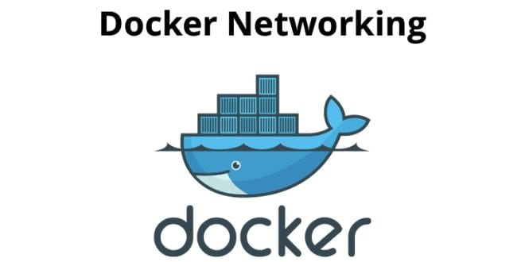

# Práctica: Servidor Web


## 1. Título  
**Implementación de contenedores Docker: MySQL y phpMyAdmin en red personalizada**

## 2. Tiempo de duración  
**120 minutos (2 horas)**

## 3. Fundamentos

Docker es una plataforma de contenedores que permite empaquetar aplicaciones y sus dependencias en unidades portables. En esta práctica se utilizaron contenedores de **MySQL**, un motor de bases de datos relacional de código abierto, y **phpMyAdmin**, una herramienta cliente para la administración visual de bases de datos MySQL y MariaDB.

La creación de una red personalizada en Docker permite que varios contenedores se comuniquen entre sí de forma aislada del resto de la red del host. Gracias a este concepto, es posible establecer comunicación entre contenedores utilizando el nombre del contenedor como hostname.

**MySQL** proporciona almacenamiento estructurado, mientras que **phpMyAdmin** facilita su administración vía web, evitando la necesidad de interactuar únicamente por línea de comandos.

Durante el desarrollo de la práctica, se aplicaron conocimientos sobre comandos básicos de Docker, tales como `docker network create`, `docker run`, `docker ps`, `docker image ls`, entre otros.

<div align="center">
  
  <br>
  Figura 1. Docker network.
</div>

<div align="center">
  
  <br>
  Figura 1.  Arquitectura de contenedores.
</div>

 
## 4. Conocimientos previos

Para realizar esta práctica, el estudiante debe tener claros los siguientes temas:

- Comandos básicos de Linux.
- Manejo básico de la terminal o consola de comandos.
- Uso de navegador web para acceder a servicios locales.
- Conocimientos sobre bases de datos relacionales (MySQL).
- Entendimiento básico de arquitectura cliente-servidor.
- Familiaridad con conceptos de redes (puertos, IPs).


## 5. Objetivos a alcanzar

- Implementar contenedores de bases de datos y herramientas de administración web utilizando Docker.
- Crear y gestionar redes personalizadas en Docker.
- Conectar dos contenedores utilizando una red propia.
- Administrar bases de datos MySQL mediante phpMyAdmin.
- Crear bases de datos y tablas a través de interfaces gráficas.


## 6. Equipo necesario

- Computador con sistema operativo **Windows/Linux/Mac**.
- Instalación de **Docker** versión 20.0 o superior.
- Cuenta en **Docker Hub** (opcional para la descarga de imágenes).
- Acceso a terminal (CMD, PowerShell, Terminal de Linux o Mac).
- Navegador web actualizado (Chrome, Firefox, Edge).
- Conexión a Internet para descargar imágenes de Docker.


## 7. Material de apoyo

- [Documentación oficial de Docker](https://docs.docker.com/)
- [Documentación de PostgreSQL](https://www.postgresql.org/docs/)
- [Guía de Informe](https://github.com/maguaman2/informe-tendencias)
- Documentación oficial de phpMyAdmin: [https://docs.phpmyadmin.net/](https://docs.phpmyadmin.net/)
- Guía de comandos básicos de Linux.
- Guía video colocado en la plataforma de youtube https://www.youtube.com/watch?v=F_aL2Aw5wcE

## 8. Procedimiento

**Paso 1:** Crear un contenedor para MySQL, definiendo las credenciales necesarias.

```bash
docker run -d --name dbpsql -e POSTGRES_PASSWORD=admin  -p 5432:5432 postgres
```
```bash
# docker run: Correo la imagen de postgres (desde dockerhub.com)
# -d: Correo en segundo plano. 
# --name: Nombre del contenedor de postgres
# -e: variable de entorno para el usuario Postgres
# -p: puerto del anfitrion y del contenedor
# postgres: nombre de la imagen tal cual aparece en el buscardor de dockerhub
```
> **Figura 8-1-1.** Crear contenedor con imagen **postgres**
 
 
**Paso 2:** Crear un contenedor para phpMyAdmin, configurando las credenciales
```bash
docker run -d --name pgadmin -p 8090:80 -e PGADMIN_DEFAULT_EMAIL=fmgonzalez@sudamericano.edu.ec -e PGADMIN_DEFAULT_PASSWORD=admin dpage/pgadmin4
```
> **Figura 8-2-1.** Crear contenedor con imagen **pgadmin**
 

 > **Figura 8-2-2.** Revisar las imagenes de cada contenedor
 

 > **Figura 8-2-3.** Revisar contenedores creados correctamente en **DockerDesktop**
 
 
**Paso 3:** Crear una red personalizada en Docker que permita la comunicación entre ambos contenedores.

```bash
docker network create --attachable redfranks
```

> **Figura 8-3-1.** Crear red 
 

**Paso 4:**   Conectar ambos contenedores a la red creada.

```bash
# Agregar contenedor de postgresql
docker network connect redfranks dbpsql

# Agregar contenedor de pagadmin
docker network connect redfranks pgadmin
```
> **Figura 8-4-1.** 
 

 ```bash
# verificar contenedores conectados a la red. Este comando muestras las IPs
# asignadas a cada contenedor
docker inspect redfranks
```
> **Figura 8-4-2.** 
 
 


 
**Paso 5:** Configurar la conexión entre phpMyAdmin y MySQL, y crear una base de datos de prueba desde la interfaz de phpMyAdmin.
```bash
http://localhost:8090
```
> **Figura 8-5-1.** Acceder a phpMyAdmin
 
 

> **Figura 8-5-2.** Crear la base de datos 
 
 
 
 
 
 > **Figura 8-5-3.** Crear una tabla 
 
 

## 9. Resultados esperados

Al finalizar la práctica, se obtuvieron los siguientes resultados:

- Se creó exitosamente una red de Docker personalizada denominada `redfranks`.
- Se desplegaron y ejecutaron correctamente los contenedores de **MySQL** y **phpMyAdmin** dentro de la red creada.
- Se estableció la conexión entre los contenedores mediante el nombre del servicio, permitiendo una comunicación efectiva sin necesidad de utilizar direcciones IP.
- Se accedió satisfactoriamente a la herramienta phpMyAdmin a través del navegador web utilizando la dirección `http://localhost:8090`.
- Desde la interfaz de phpMyAdmin, se creó la base de datos `apiTest`.
- Dentro de la base de datos `apiTest`, se generó la tabla `customers` con los campos: `id`, `first_name`, `last_name`, `email` y `created_at`.
- Se verificó que los contenedores se encontraban activos y comunicándose 
  
  ## 🔊 Audio Explicativo de la practica.
https://drive.google.com/file/d/12Gb5MJWE1n1QDOJSKrgBs-D5jndHYhR8/view?usp=sharing

## 10. Bibliografía

- PostgreSQL: documentation. (s. f.). The PostgreSQL Global Development Group. https://www.postgresql.org/docs/
- Play with Docker. (s. f.). https://labs.play-with-docker.com/
- Microsoft. (s.f.). *Windows Subsystem for Linux Documentation*. Recuperado de [https://learn.microsoft.com/en-us/windows/wsl/](https://learn.microsoft.com/en-us/windows/wsl/)
